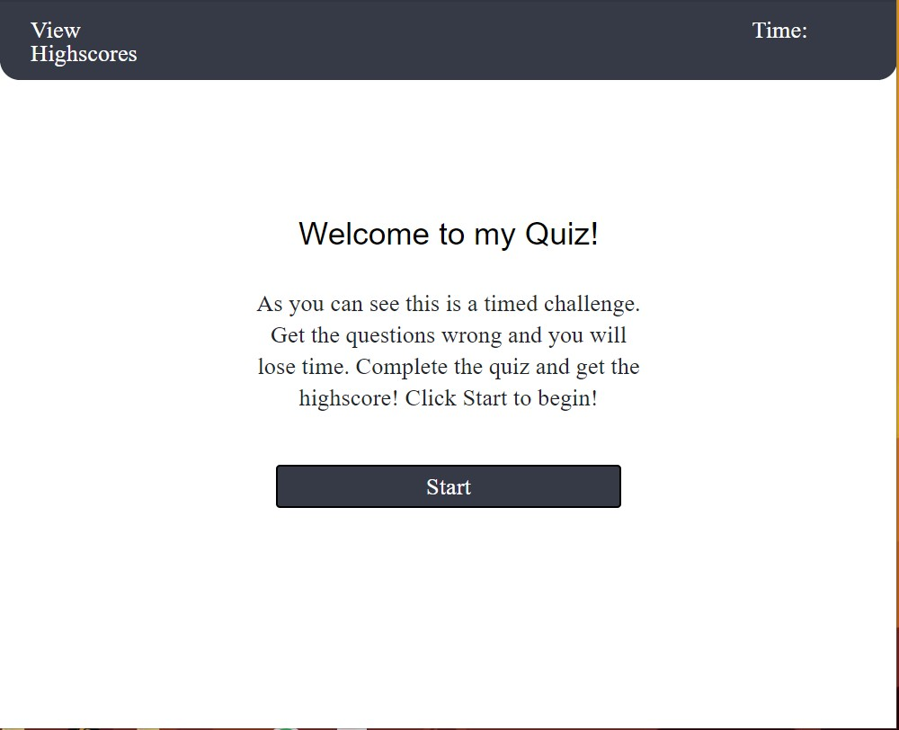
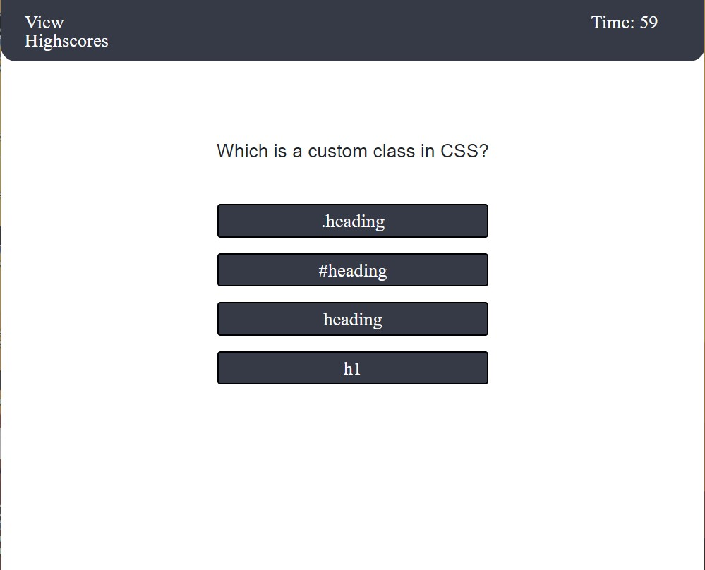
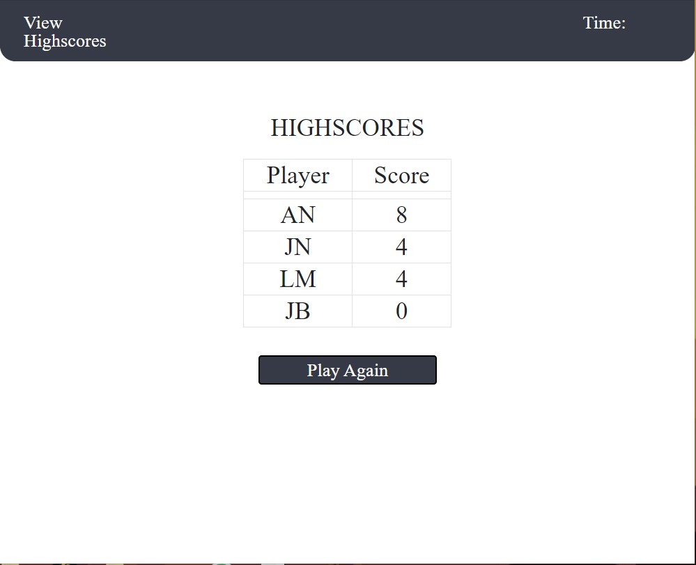

# code_quiz

## Description 

This is a simple quiz game about HTML and CSS. The user will have 60 seconds to answer as many questions as they can. For each correct question they will get 1 point. At the end of the game, either by answering all the questions or running out of time, the user will get to see their score and submit it along with their initials to the high score board. The user will also be able to replay the game to try and get a higher score. At any time they can view the highscores. 

## Git Hub Repo
https://github.com/adamnatrop/code_quiz

## Git Hub Live Page
https://adamnatrop.github.io/code_quiz/

